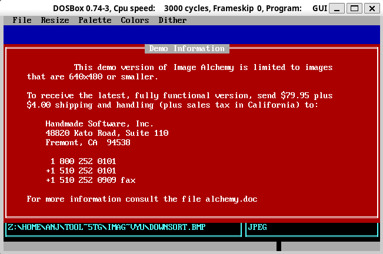

Image Alchemy
=============


```
docker build -t alchemy .
```

```
docker run alchemy wine ALCHEMY.EXE 
```

Convert Spaceward Graphics to TIFF:
```
ALCHEMY.EXE "FILE.R" -t
```

You can use `---n` to convert to PNG, but only later versions support that (1.8 does not, 1.11 does).

Quickly becomes a pain due to file permissions - the container runs as a different user.  Copying the test file to `/tmp/` first does work:

```
cp DOWNSORT.BMP /tmp
docker run -v /tmp:/tmp -w /tmp alchemy wine /tool/ALCHEMY.EXE DOWNSORT.BMP ---n
cp /tmp/DOWNSORT.PNG .
```

So this could be wrapped up as a script.

Noting this:

```
display DOWNSORT.BMP
display-im6.q16: length and filesize do not match `DOWNSORT.BMP' @ error/bmp.c/ReadBMPImage/848.
```
and it also looks wonky. But then it's an OS/2 BMP so maybe that's the problem

Related: 

- [Image Alchemy - Just Solve the File Format Problem](http://justsolve.archiveteam.org/wiki/Image_Alchemy)
- [Image Alchemy User's Manual - Internet Archive](https://archive.org/details/manualzilla-id-5894277/mode/2up)
- [notebook/spaceward-research.md at main · anjackson/notebook](https://github.com/anjackson/notebook/blob/main/spaceward-research.md)




## ImageAlchemy 1.11 English (Demo)

This is the concatenated version of the full help text from the `ALCHEMY.EXE` tool, collected using e.g.

```
dosbox -c 'mount c "~/wine/Image Alchemy.ver.1.11.0.English"' -c "c:" -c "ALCHEMY.EXE -h0 > LOG.TXT" -c "exit"
```

### Help

```
              Welcome to the Image Alchemy Help system

   Because of the large number of options available in Alchemy the
   help information is divided into different sections.  To access the
   different sections enter the section number after the -h option.

     For example, to get help on the colour options enter -h4

      Section   Category
         0      This message
         1      General options {Chapter 5}
         2      File formats A through L {Chapter 4}
         3      File formats M through Z {Chapter 4}
         4      Colour and palette options {Chapter 6}
         5      Scaling options {Chapter 7}
         6      Display options (MS-DOS only) {Chapter 8}

     General options:

     -$:  Control memory usage {253}
     -x:  Display image stats {255}
     -.:  Do not alter output file name {256}
    --.:  Do not remove old extension {257}
     -h:  Display help screen {258}
     -U:  Multi-page input {259}
   ---U:  Multi-page output {261}
     -=:  Override Input Type {263}
     -o:  Overwrite existing file {265}
     -?:  Program information {266}
     -Q:  Quiet (no status messages) {267}
      @:  Response files {268}
     -@:  Response output filenames {270}
    --@:  Response paired filenames {272}
    ---:  Sequential filenames {273}
    --.:  Use input directories for output {276}
    --=:  Use input file format for output {277}
    --o:  Use input filename for output {278}
    --3:  Use three letter extensions {279}
    --W:  Enable warnings {280}
     --:  Enable wildcard mode {281}

   Output file formats A through L:

     ADEX {95}..................... --A  FOP {135}..................... --f
     Adobe PDF {96}................ --d  Gem VDI Image {136}........... --g
     Adobe Photoshop {98}......... ---p  GIF {138}...................... -g
     Alias PIX / Vivid IMG {100}... --I  GOES {144}.................... --G
     Alpha BMP {101}................ -M  Histogram {146}................ -H
     Alps {102}................... ---a  Hitachi Raster {148}.......... --h
     Autodesk PIC/CEL {103}....... ---l  HP PCL {149}................... -P
     Autologic {104}............... --a  HP PhotoSmart {156}.......... ---S
     AVHRR {105}................... --R  HP RTL {158}.................. --r
     AVS X {107}.................. ---A  HP-48sx {164}................. --H
     Binary (BIF) {108}............. -B  HSI JPEG {165}................ --j
     Calcomp {111}................. --l  HSI Palette {166}.............. -l
     CALS {114}.................... --c  HSI Raw {167}.................. -r
     Core IDC {114}................ --B  IBM Picture Maker {168}....... --i
     Cubicomp {116}................ --P  IDRISI {169}................. ---I
     Dr. Halo CUT {118}............ --C  IFF/ILBM {171}................. -i
     Enc. PostScript {119}.......... -e  Imaging Technology {172}..... ---M
     Epson Stylus {122}............ --K  Img Software Set {173}........ --Q
     ER Mapper Raster {124}........ --m  Intergraph {174}............. ---r
     Erdas LAN/GIS/IMG {126}....... --e  Iris CT {175}................ ---Q
     Explore TDI {129}.............. RO  JEDMICS CCITT4 {176}......... ---E
     Fargo Primera {130}........... --k  Jovian VI {177}............... --J
     FBM {132}.................... ---F  JPEG {178}..................... -j
     First Publisher {133}......... --F  Lumena CEL {181}.............. --L
     FLC {134}...................... RO

   For more information see the page number specified in { } after
   the format name (addendum refers to the addendum).  RO instead
   of an output option means the file format is Read Only.

   Output file formats M through Z:

     Macintosh PICT {182}........... -m  Scitex CT {215}.............. ---X
     MacPaint {184}................ --t  Scodl {216}................... --s
     MIFF {185}................... ---i  SGI Image {218}................ -n
     Mimaki MRL-1 {186}........... ---m  Sharp GPB {219}.............. ---G
     MTV {187}..................... --M  Spaceward {220}.............. ---s
     Multi-Image Palette {187}...... -L  SPOT Image {221}.............. --S
     OS/2 BMP {190}................. -O  Stork {223}.................... -K
     OS/2 Icon {191}............... --O  Sun Icon {225}................ --N
     PCPaint/Pictor {193}........... -A  Sun Raster {226}............... -s
     PCX {196}...................... -p  Targa {228}.................... -a
     PDS {199}..................... --p  TIFF {230}..................... -t
     PhotoCD {201}.................. RO  US Patent Image {234}........ ---P
     Pixar PIC {202}.............. ---j  Utah RLE {235}................ --u
     Pixel Power Collage {203}.... ---c  Verity Image Format {237}..... --E
     PNG {204}.................... ---n  VIFF {238}................... ---v
     Portable BitMap (PBM) {206}.... -k  VITec {239}.................... -T
     Puzzle {208}.................. --U  Wavefront RLA {241}............ RO
     Q0 {209}...................... --q  Windows BMP {242}.............. -w
     QDV {210}..................... --D  WPG {245}...................... -W
     QRT Raw {211}................. --T  XBM {246}..................... --b
     Raster Graphics {212}........ ---g  XIM {247}.................... ---x
     RIX {213}...................... -R  XPM {248}..................... --x
     RLC {214}.................... ---R  XWD {251}..................... --w

   For more information see the page number specified in { } after
   the format name (addendum refers to the addendum).  RO instead
   of an output option means the file format is Read Only.

     Colour and palette options:

     -I:  Alpha channel {284}
     -b:  Black and white {285}
   ---y:  Brightness {287}
   ---K:  CMYK {288}
     -C:  Color correction {289}
     -c:  Colours in output image {290}
   ---Y:  Contrast {292}
     -d:  Dithering type {293}
     -E:  EGA display optimization {295}
     -F:  False colour {296}
    -Gi:  Specify gamma of input image {297}
    -Go:  Specify gamma of output image {297}
    -Gp:  Specify gamma of palette {297}
     -f:  Match palette {299}
     -N:  Negate  {301}
     -8:  Paletted output {302}
   ---f:  Preserve palette while scaling {309}
     -S:  Spiff {310}
    --n:  Swap RGB  {312}
   ---t:  Transparency {313}
    -15:  True colour output (15 bits per pixel) {314}
    -16:  True colour output (16 bits per pixel) {315}
    -24:  True colour output (24 bits per pixel) {316}
    -32:  True colour output (32 bits per pixel) {318}
     -u:  Uniform palette {319}

     Scaling and filtering options:

    --_:  Center image {322}
    --y:  Change image resolution {324}
    -yf:  Convolve image {326}
     -^:  Flip image {327}
    --^:  Mirror image {328}
     -_:  Offset image {329}
    --+:  Only scale if too large {331}
   ---+:  Only scale if too large {332}
     -+:  Preserve aspect ratio {333}
   ---f:  Preserve palette while scaling {334}
     -X:  Scale image to new horizontal size {335}
     -Y:  Scale image to new vertical size {338}
    --X:  Set Horizontal DPI {340}
    --Y:  Set Vertical DPI {342}
     -D:  Specify aspect ratio {344}
     -D:  Specify image resolution in DPI {346}

     Viewing options:

     -_:  Offset view {354}
     -~:  Slide show {355}
     -v:  View image on 8 bit display {356}
    --v:  View image on true colour display {357}
     -V:  View reduced image on 8 bit display {359}
    --V:  View reduced image on true colour display {361}

```

### Warning

```
    This is a demo version of Image Alchemy.  It is limited to images
    that are 640x480 or smaller.

    To receive the latest, fully functional version, send $79.95 plus
    $6.00 shipping and handling (plus sales tax in California) to:

        Handmade Software, Inc.
        48860 Milmont Drive, Suite 106
        Fremont, CA  94538

         1 800 252 0101
        +1 510 252 0101
        +1 510 252 0909 fax

    For more information consult the file alchemy.pdf
```

